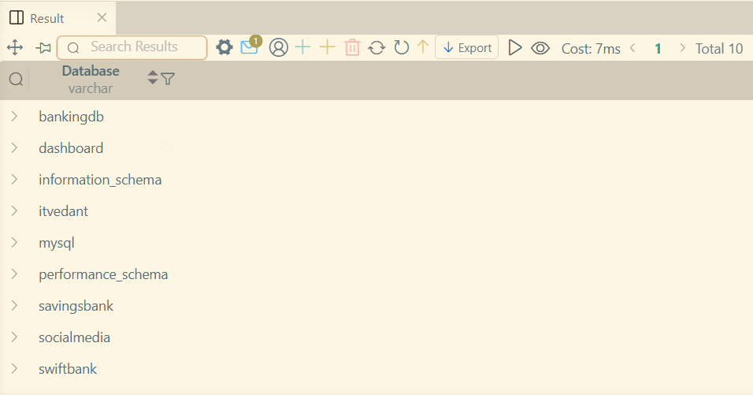
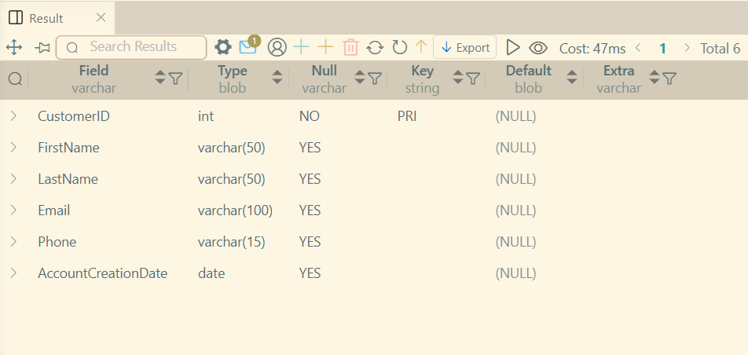

# LAB 1

### Concepts covered
* Setting up MySQL
* Creating and Viewing Databases
* Creating tables with DataTypes
* Viewing table after creation

### Listing databases
```sql
SHOW DATABASES;
```



### Describing a table
```sql
DESCRIBE Customers;
```

