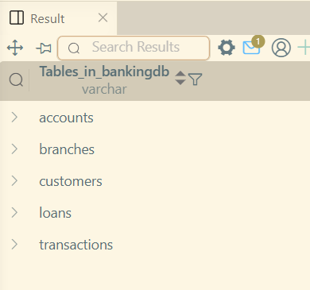
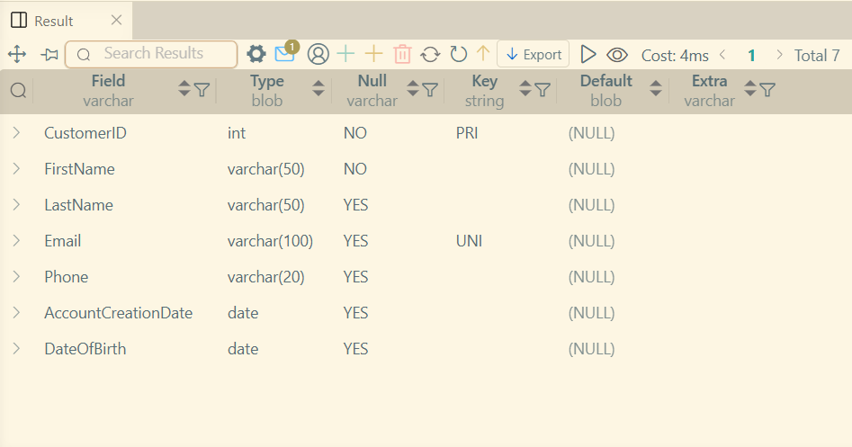
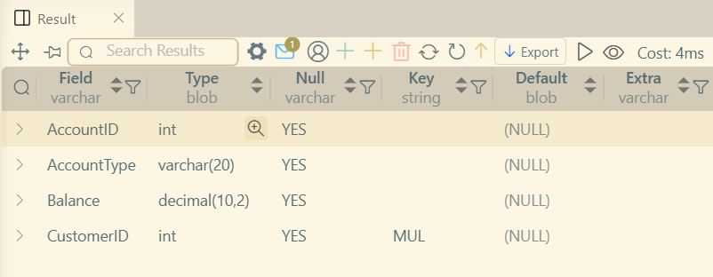
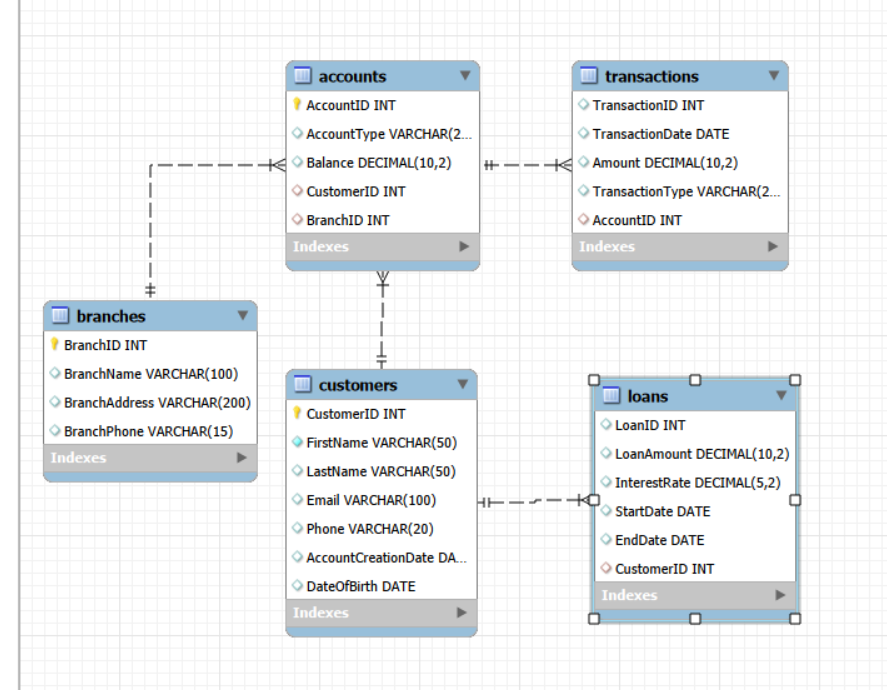

# LAB 2

### Contents Covered
* Adding columns, changing Datatypes and adding Contraints of a table after creation.
* What are Primary Key and Foreign Key.
* Relationships 1-1, 1-N, N-N.
* Creating entity-relationship-diagram in MySQL Workbench.

#### Created tables

#### Customers table after modify

#### Accounts table after modify

#### ERD(Entity-Relationship-Diagram)
