# LAB 4 - DQL

### Covered Concepts
* Viewing whole table
* Viewing selected column
* Filtering rows by values
* Sorting the View
* Use of DISTINCT
* Conditional column creation
* Window Function OVER()

| **Topic** | **ScreenShot** |
|-|-|
| Entire table | 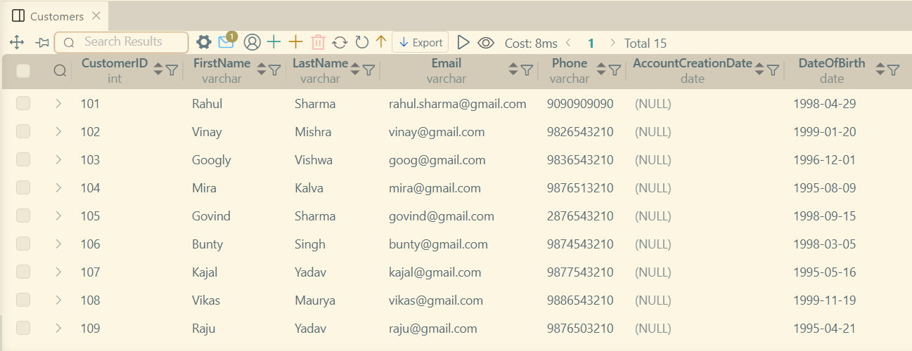  |
| Selected columns | 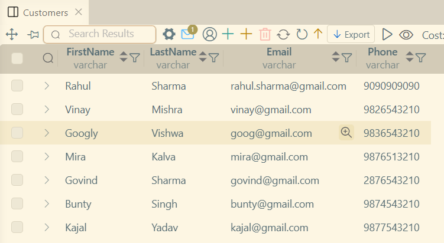  |
| Activity1 | 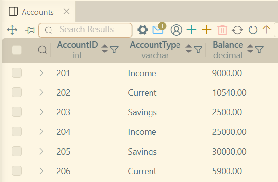  |
| Only Savings Account | 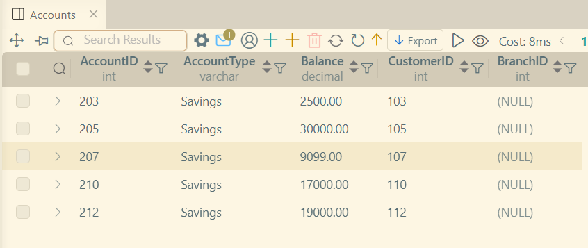  |
| Accounts with Balance > 25000 | 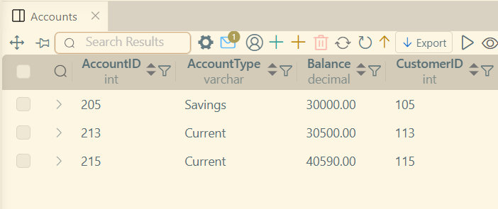  |
| Amount BETWEEN 5000 AND 20000 | 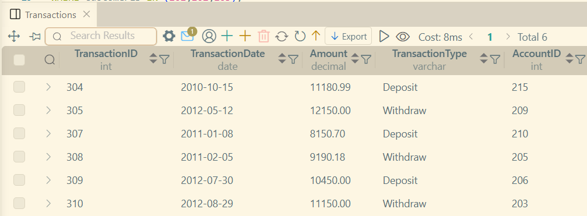  |
| CustomerID IN (101,102,103) | 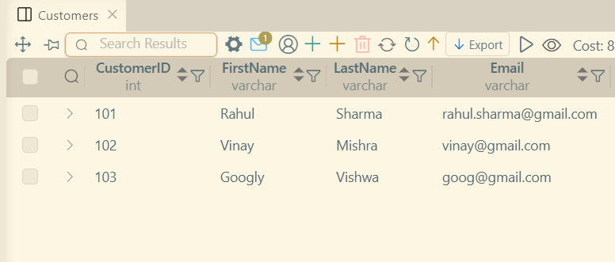  |
| FirstName Startswith **R** | 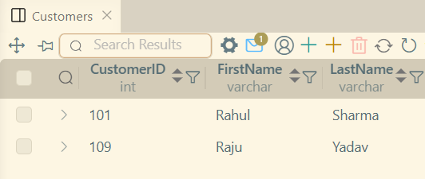  |
| Account type is Current | 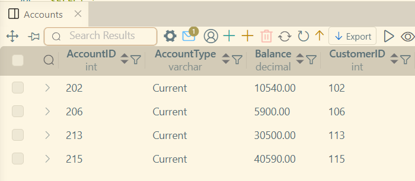  |
| Balance is lower than 15000 | 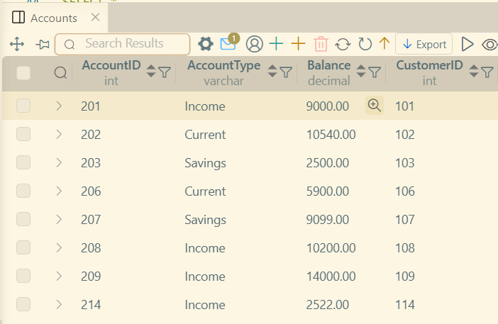  |
| transaction amount between 1000 and 10000 |   |
| Display customer 104 and 105 |   |
| Customer lastname startswith **S** |   |
| Sort by customer's firstname |   |
| Sort by Account Balance | 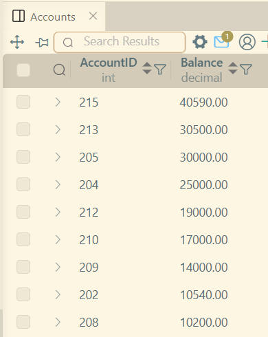  |
| List account types | 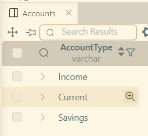  |
| Top 3 Balance | 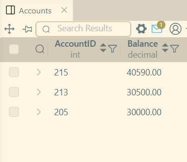  |
| Skip first 2 then select 5 | 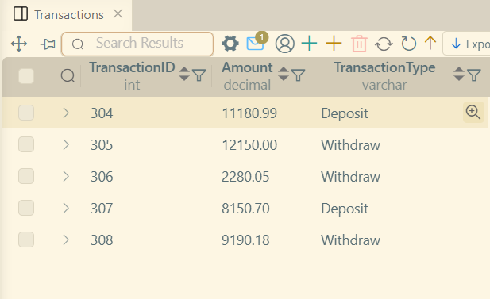  |
| Sorted lastname | 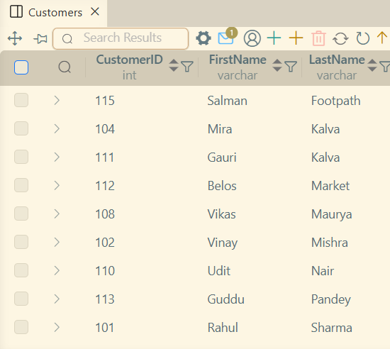  |
| Top 5 Transaction Amounts | 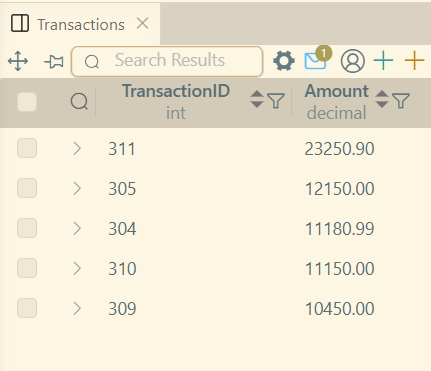  |
| List types | 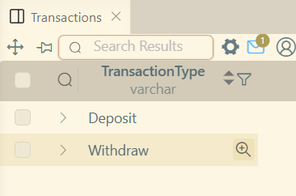  |
| Skip 3 select 4 | 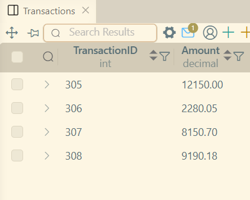  |
| Categorising Balance | 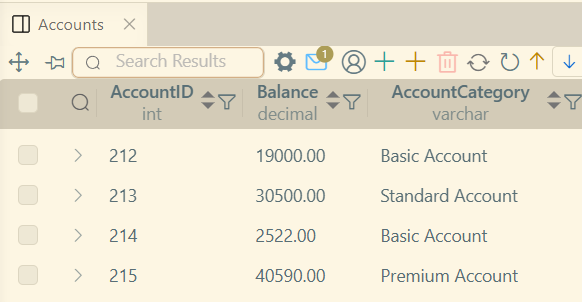  |
| Categorising Amount | 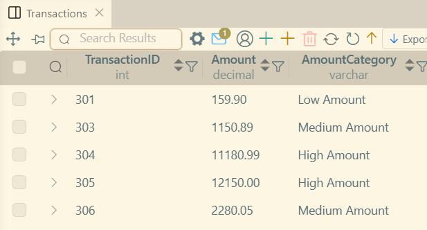  |
| Rank Balance | 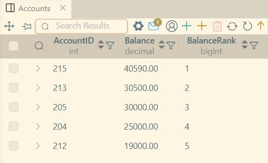  |
| Running Total of transactions | 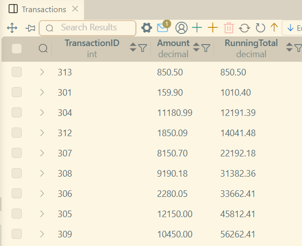  |
| Display total average | 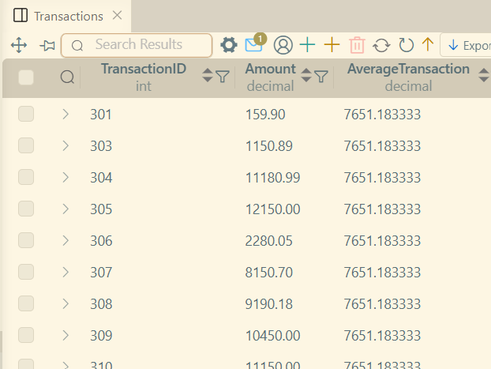  |
| Rank customers by balance | 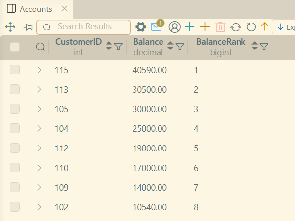  |
| Running Total Balance | 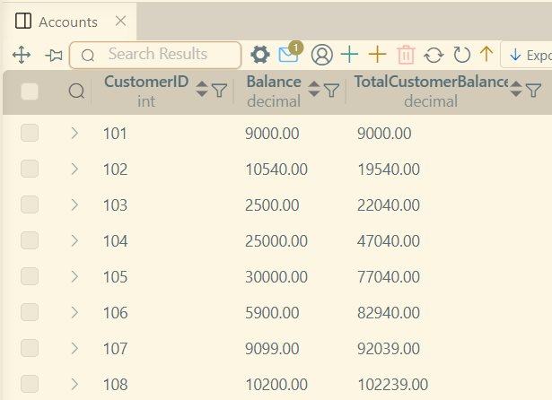  |
| Display Greatest Amount | 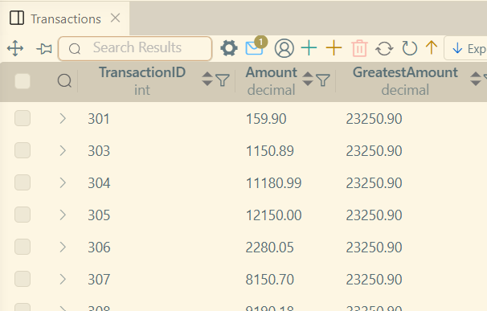  |