# LAB 5 - Applying DQL

|**Topic**|**Screen Shot**|
|-|-|
| Customer first name starting with **G** | 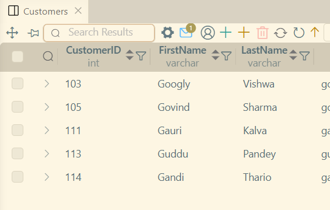|
| Customer email with gmail | 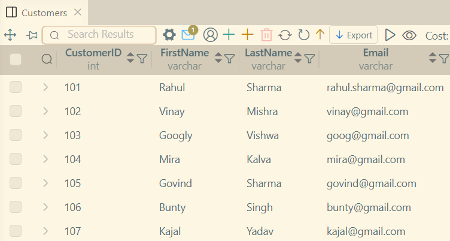 |
| Customer last name ending with **a** | 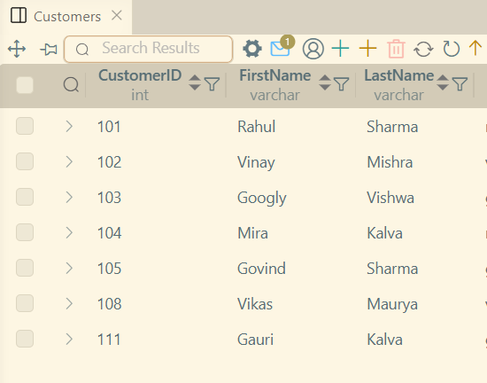 |
| Customer first name starting with **R** | 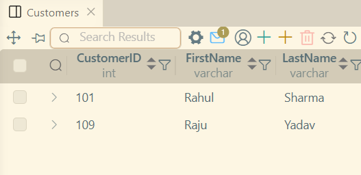 |
| Customer email with yahoo | 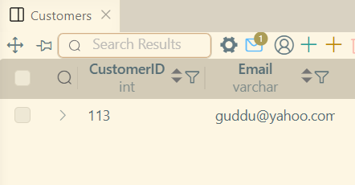 |
| Customer last name starting with **P** | 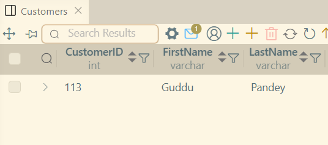 |
| Customer with phone number ending in 99 | 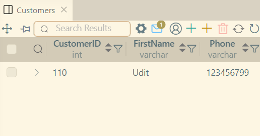 |
| Only savings and current account | 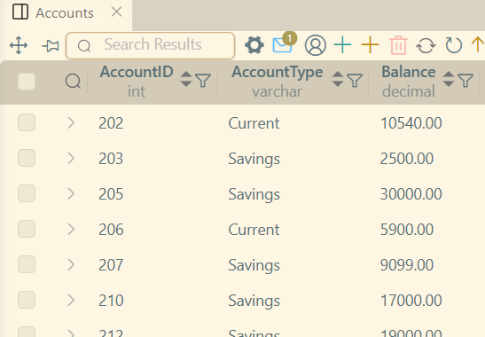 |
| Only customerID 101 102 and 105 | 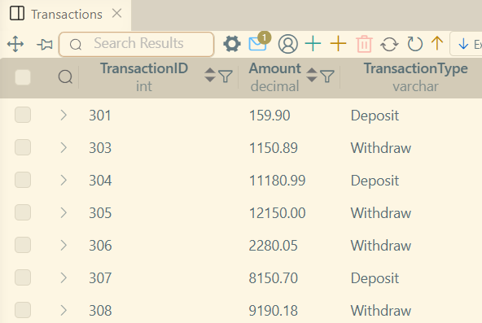 |
| Only savings and Income account | 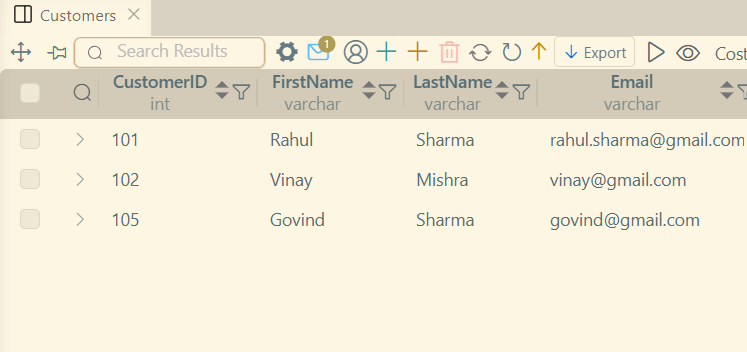 |
| Only deposited amount and amount of payment | 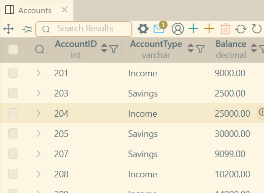 |
| Only customerID 103, 104 | 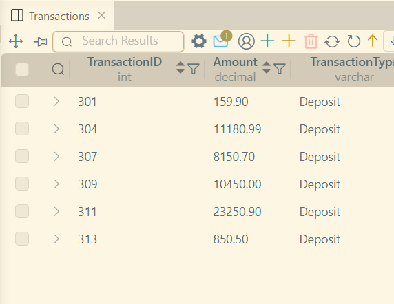 |
| Only accountID 203, 204 | 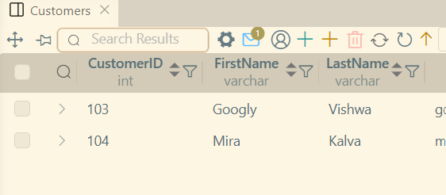 |
| Sorted last name | 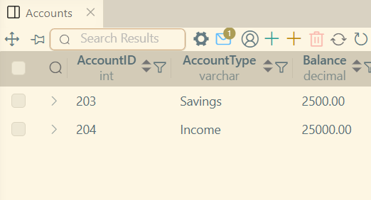 |
| Higher to lower balance amount | 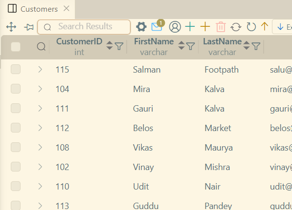 |
| latest to oldest transactions | 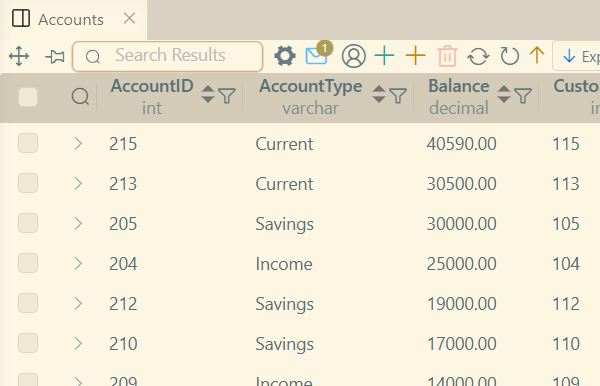 |
| Sorted first name | 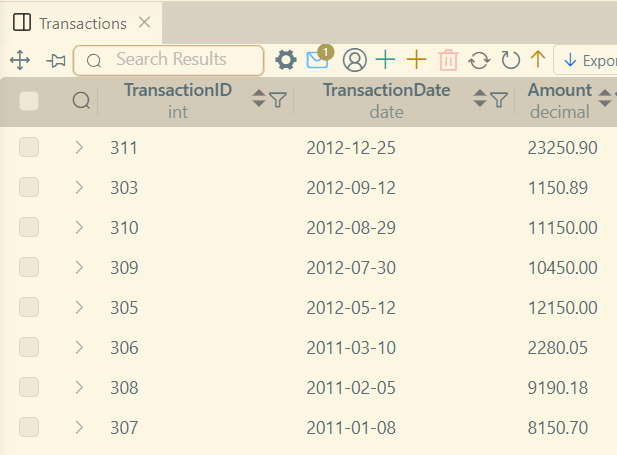 |
| Sorted account type | 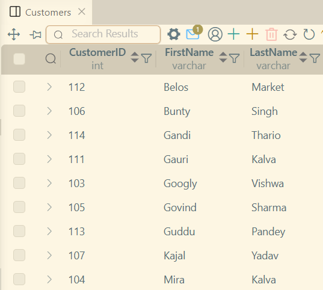 |
| Descended sort of amount | 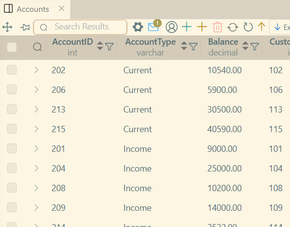 |
| Sorted by date of birth | 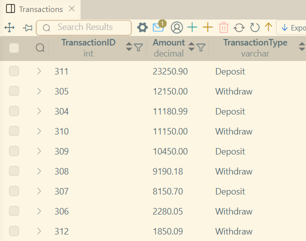 |
| Top 5 highest balance | 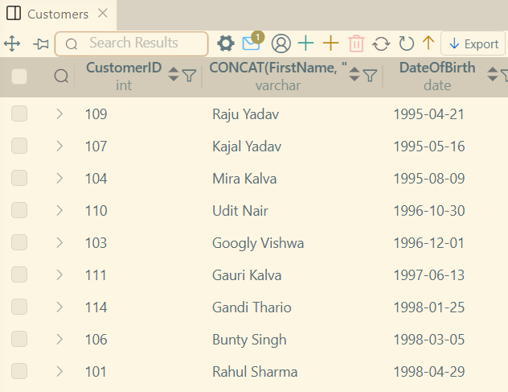 |
| 3 Customers | 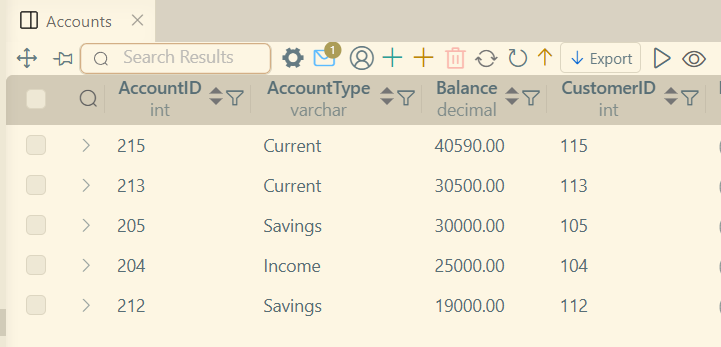 |
| Skip 3 and show 5 after skip | 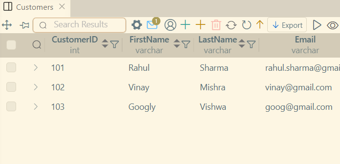 |
| Top 3 highest amount | 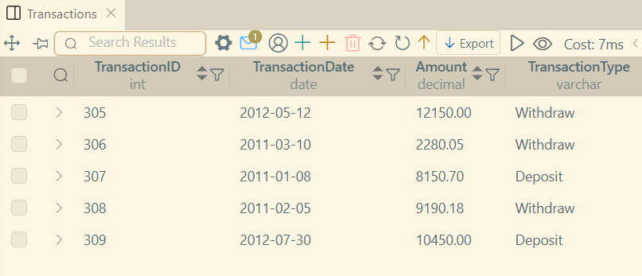 |
| 4 Customers | 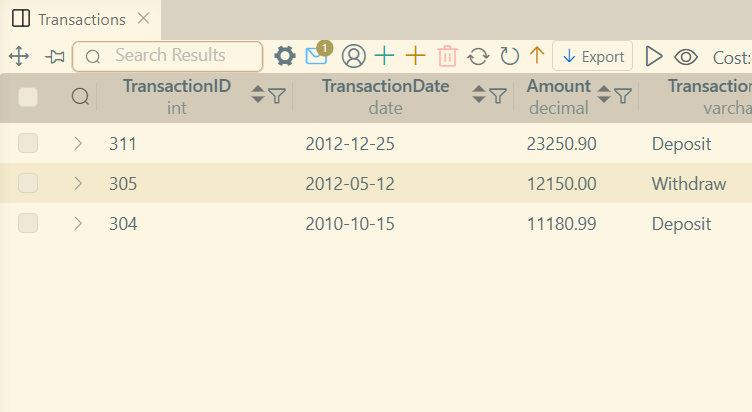 |
| Skip 2 and show 3 after skip | 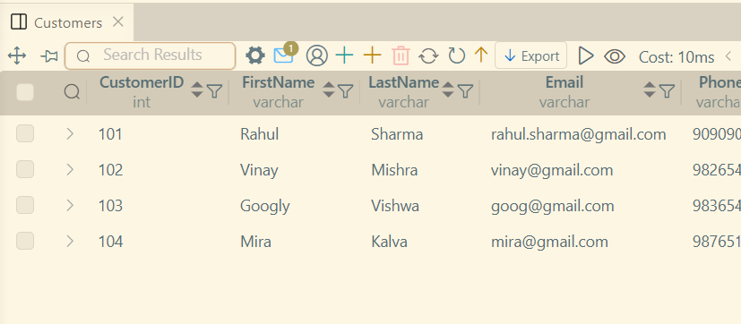 |
| only savings in descending order | 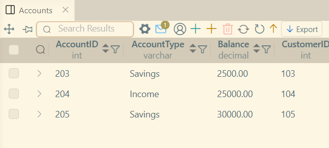 |
| first name starts with **S** show only 5 | 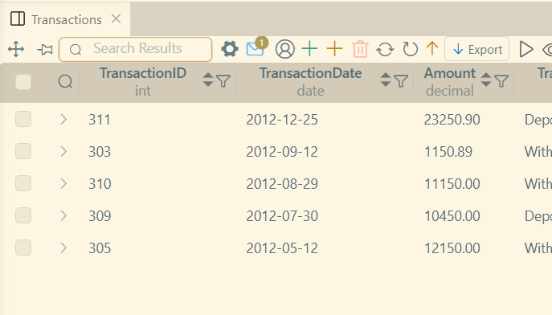 |
| | 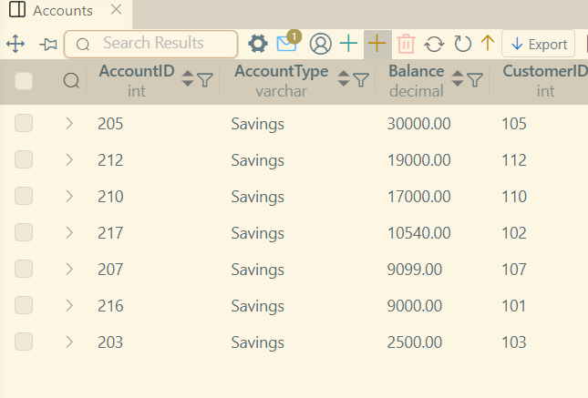 |
| | 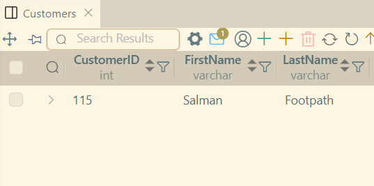 |
| | 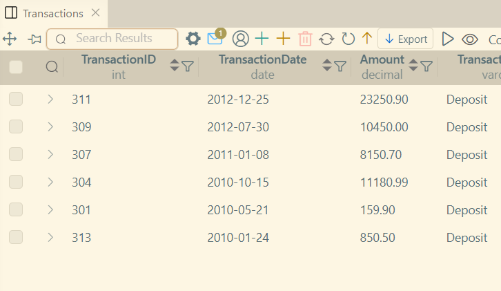 |