# LAB 6 - Generate Banking Summary Reports Using Aggregations

### Topics Covered
1. String Function
2. Math Function
3. Date and Time Function
4. Comparison Function
5. Aggregate Function

| **Topic** | **Screen Shots** |
|-|-|
| Using String functions | 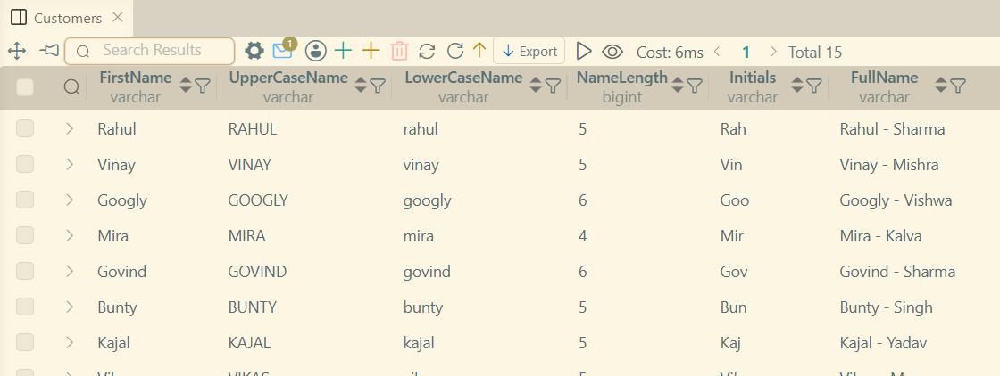 |
| Using Math functions | 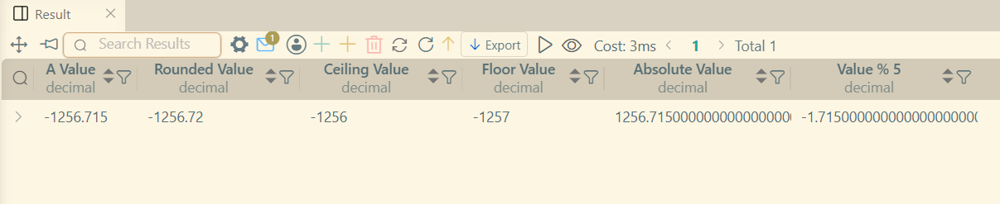 |
| `curdate()` and `now()` | 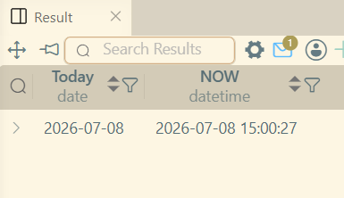 |
| `year()`, `month()` and `datediff()` | 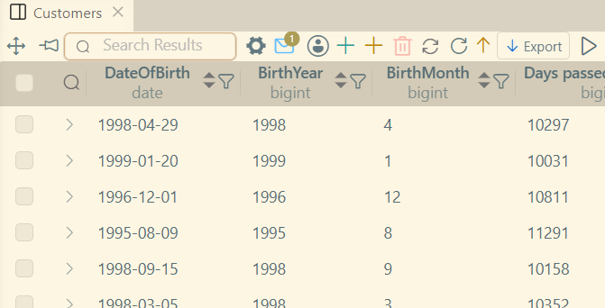 |
| Usage of `IF()` to create Category | 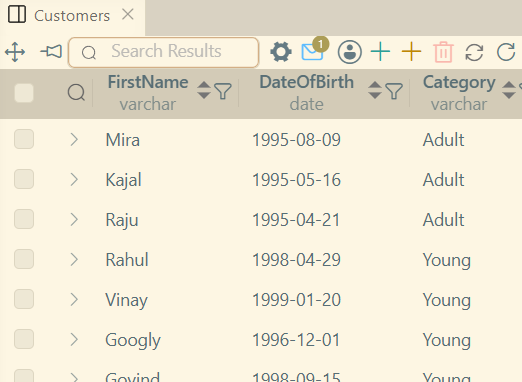 |
| Usage of `IFNULL()` | 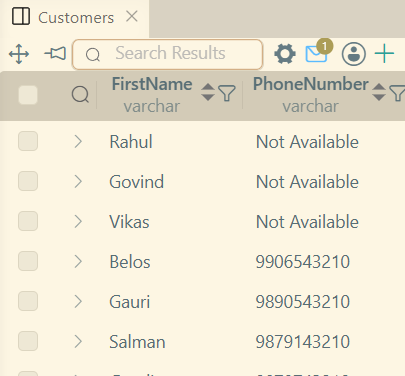 |
| Finding greatest out of few dates. | 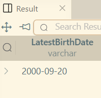 |
| Finding least out of few dates. | 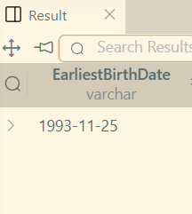 |
| Usage of `NULLIF()` | 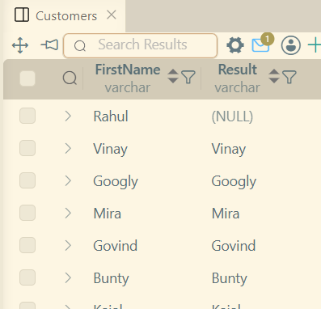 |
| Aggregate function on Account Balance | 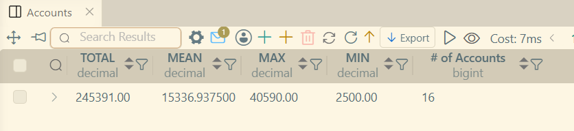 |
| Total Balance per AccountType | 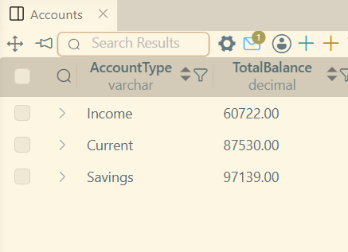 |
| Used HAVING Clause with `> 75000` | 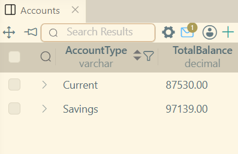 |