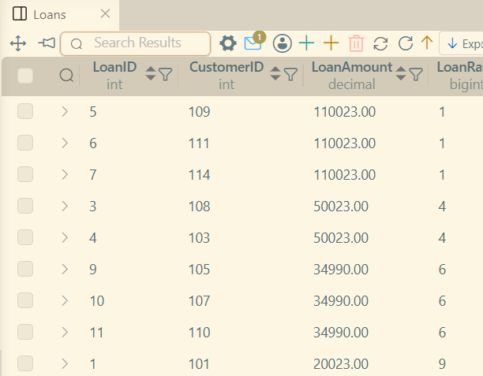
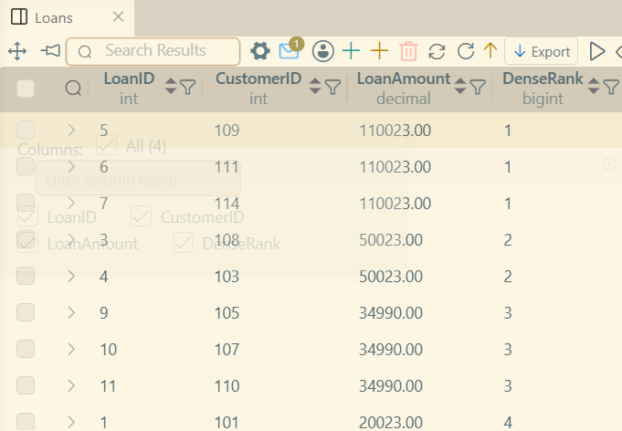
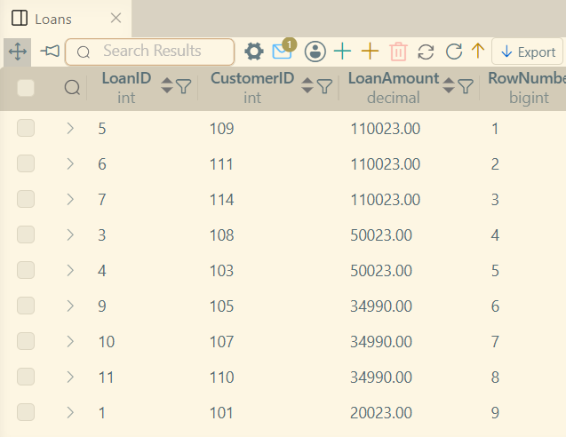
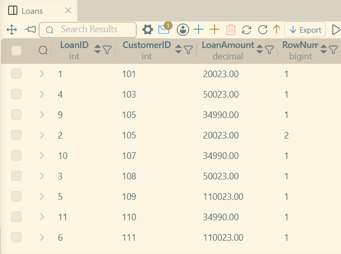
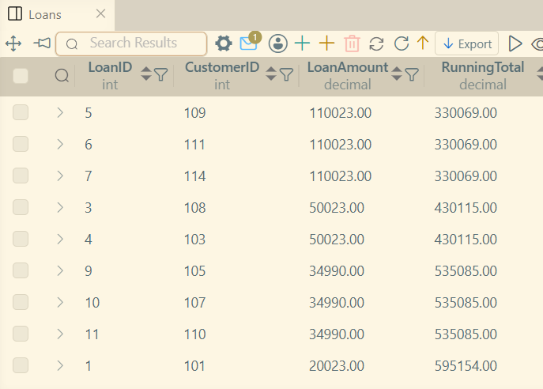
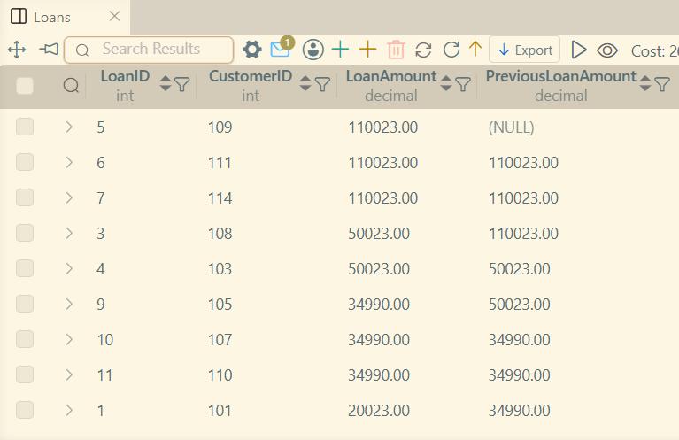
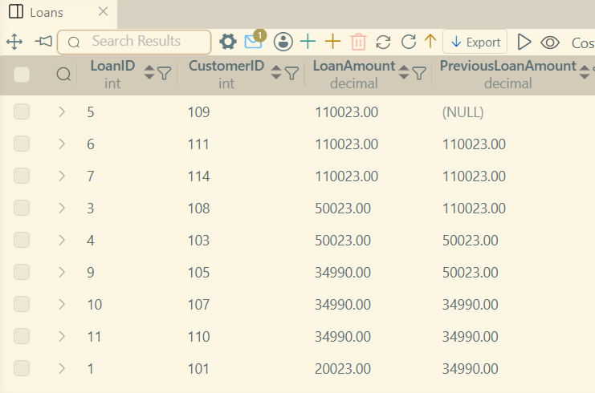

# LAB 7 - Analyze Loan Risk Using Window Functions

### Concepts Covered
1. OVER clause
2. Window Functions
    * RANK(), DENSE_RANK() and ROW_NUMBER()
    * Running totals with SUM()
    * LAG() and LEAD()
3. Partitioning Data with PARTITION BY

### Understanding OVER
Windowing data lets one divide data and mutliple entries into groups or treat as one group and perform calculations with the grouping.
For example ranking Accounts by the Balance they hold.

### Codes executed
| | |
|-|-|
| Ranking LoanAmount using `RANK()` |  |
| Ranking LoanAmount using `DENSE_RANK()` |  |
| Using `ROW_NUMBER()` |  |
| Applying `ROW_NUMBER()` after forming group by CustomerID |  |
| A running sum of `LoanAmount` |  |
| Using `LAG()` on `LoanAmount` |  |
| Using `LEAD()` on `LoanAmount` |  |