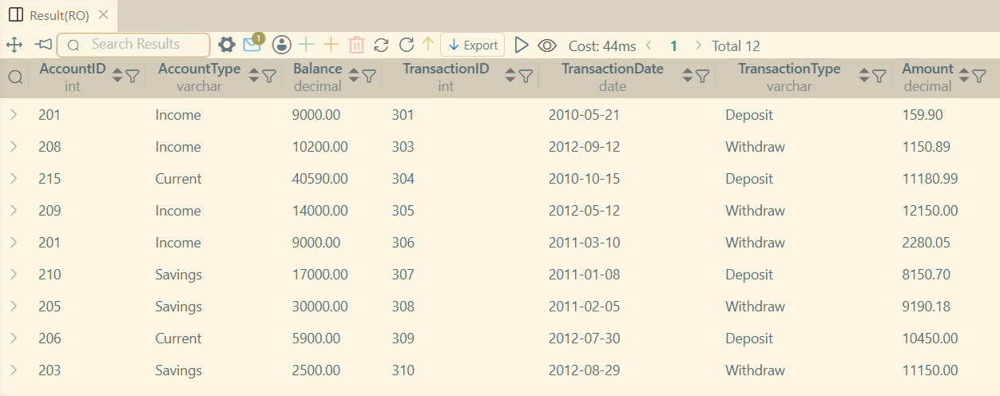
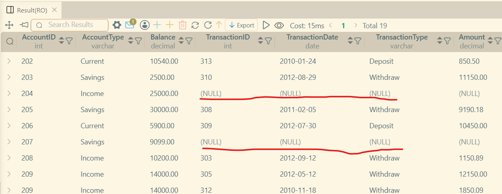
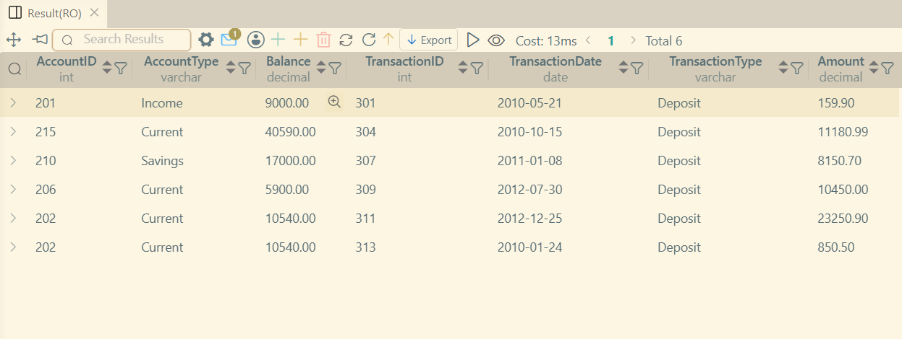
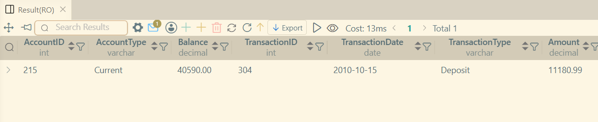

# LAB 8 - Using Table JOINS

### Covered Concepts
1. Introdution to JOINS
2. Types of JOINS
3. INNER JOIN
4. LEFT JOIN

### Features JOIN
This feature allows combining of two or more tables together to form a new table, while using the tables as one table.
The join happens on the basis of a similar field value, which show any relationship between the tables. This is where we mostly use the _primary key_ and _foreign key_ to make the connections.

### Types of JOINS
1. INNER JOIN
    Applying inner join creates table for common values from a certain(mentioned) field.
    Like _studentId_ from Student table and Course table will create a table to match students with their enrolled courses.

2. LEFT JOIN (aka LEFT OUTER JOIN)
    Left join takes all the values from the _left table_(first selected table) and finds values in right table and for any value that does not shows up in _right table_ it fills it with null values.
    Like _studenId_ that may not show up in _Course table_, this implies Student with no enrollment to any courses.

3. RIGHT JOIN (aka RIGHT OUTER JOIN)
    Right does same thing as left join but in opposite direction, that is the _right table_ becomes primary selector of values from _left table_.

4. FULL OUTER JOIN
    Union of _left table_ and _right table_.
    Wherever values are not available from another table, the _full outer join_ fills those cells with **NULL**.

### Examples
#### INNER JOIN
```sql
SELECT
    a.AccountID, a.AccountType, a.Balance,
    t.TransactionID,
    t.TransactionDate,
    t.TransactionType,
    t.Amount
FROM Accounts a
INNER JOIN Transactions t
ON a.AccountID = t.AccountID; 
```


#### LEFT JOIN
```sql
SELECT
    a.AccountID, a.AccountType, a.Balance,
    t.TransactionID,
    t.TransactionDate,
    t.TransactionType,
    t.Amount
FROM Accounts a
LEFT JOIN Transactions t
ON a.AccountID = t.AccountID;
```


#### INNER JOIN with WHERE clause
```sql
SELECT
    a.AccountID, a.AccountType, a.Balance,
    t.TransactionID,
    t.TransactionDate,
    t.TransactionType,
    t.Amount
FROM Accounts a
INNER JOIN Transactions t
ON a.AccountID = t.AccountID
WHERE t.TransactionType = 'Deposit';
```


#### INNER JOIN with WHERE clause and ORDER BY
```sql
SELECT
    a.AccountID, a.AccountType, a.Balance,
    t.TransactionID,
    t.TransactionDate,
    t.TransactionType,
    t.Amount
FROM Accounts a
INNER JOIN Transactions t
ON a.AccountID = t.AccountID
WHERE t.TransactionType = 'Deposit';
```
