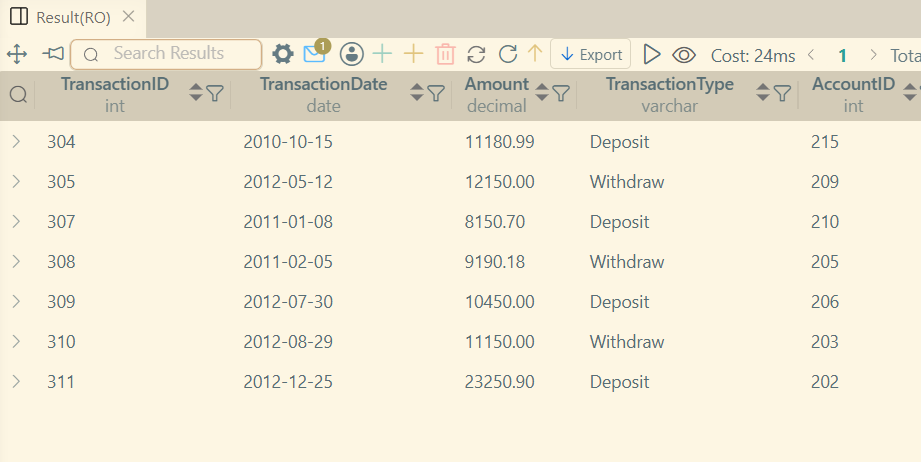
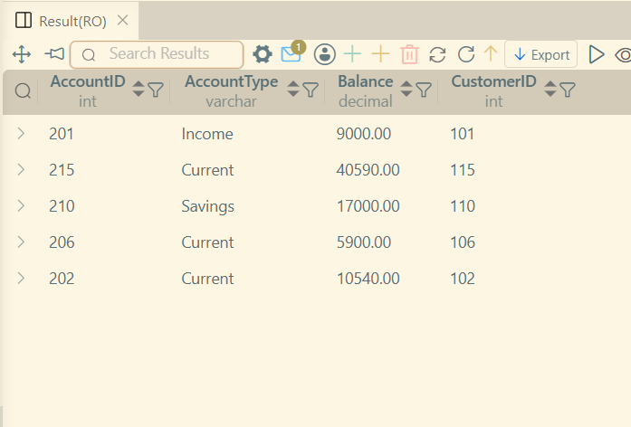

# LAB 9 - Using Subqueries

## Concepts Covered
1. Subqueries
2. Types of Subqueries

#### What is a Subquery?
A `SELECT` Query written within a Query is sub-query.
The Subquery is also known as Inner Query.
And the query which uses the Subquery is Outer Query.

#### Types of Subquery
1. Single-Row Subquery
    This is a query which returns only one value.

Example:
```sql
SELECT *
FROM Transactions
WHERE Amount >
(
    SELECT AVG(Amount)
    FROM Transactions
);
```


2. Multi-Row Subquery
    The subquery which returns Multiple values.
    Note: Multiple values require IN ANY ALL operators.

```sql
SELECT
    AccountID,
    AccountType,
    Balance,
    CustomerID
FROM Accounts
WHERE AccountID IN
(
    SELECT AccountID
    FROM Transactions
    WHERE TransactionType = 'Deposit'
);
```
